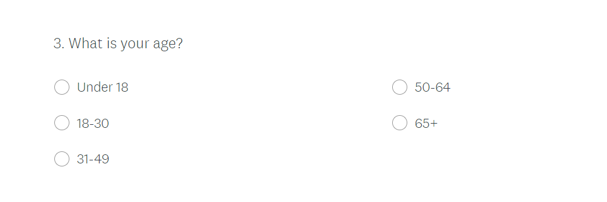

```{r setup, include=FALSE}
knitr::opts_chunk$set(echo = TRUE)
library(tidyverse)
#GIT PULL BEFORE EDITING THE FILE
```
We use @citer, @citerstudio, @citetidyverse, @citermd, @citepolls,@citeattacks, @citeban, @citelunenberg, @citearglye

# Non-technical executive summary

With the April 2020 attacks and the ban of 'assault style' firearms in May 2020, the discussion of firearms and have heightened. With this comes conversations of policies and laws that should be in place and which parties will carry out such demands.This report is written to inform the Conservartive party of Nova Scotia: Progressive Conservative Association of Nova Scotia (PC Party of Nova Scotia); about the current public opinion of their approval. 

Through cluster sampling via mail,then random selection of responses, we asked the public of Nova Scotia their thoughts about the PC Party of Nova Scotia's policies and how willing they are to vote for the party. This information along with general questions aided us in in finding correlation in approval ratings and their age. This report provides critical data for the Progressive Conservative Association of Nova Scotia, as it could inform them of possible future policies to introduce to the public or maybe laws to be lobbied to the main government.

Through several graphs and table, we hope to enlighten the party of the current political climate of the province and help suggests solutions for possible problems.


# Introduction
On the night of April 18th 2020, a mass shooting lasted 12 hours, killing at least 22 peoples; some being public workers such as a nurse and  firefighter. Following this heart-wrenching event, Canada introdused a ban of 'assualt style' firearms country wide to avoid such an event happening again. With how recent these incidents are, it brings up the conversation about gun control/violence. Bringing up these conversations make the public think more critically about their political stance and even for some, form one. The data here has been collected via online voluntary surveys and is filled with only closed questions, for easier catogerization. Due to this and the nature of our survey being voluntary, we thought that we may receive more responses asking now rather than later when these conversations have died down. When examining the data, we try to divide it through their age group and political affiliation to more easily analyse people's opinion and their support of a party. This will help the PC of Nova Scotia look at their current popularity to help gauge how the public feels about their policies and how they should adapt with these findings.

The survey itself was constructed with several goals in mind: to get a general opinion from the public while still being able to categorize these 'opinions' into charts and graphs. This challenge led to the creation of open ended questions, but the answers themselves being closed, on a scale. The scale was made very distinctive to help those convey their specific opinion through a few words. Others were binary Yes/No questions, not necessarily for public opinion but for information on how educated our sample population were on our topic of interest.This data was collected through a two-stage process. First, is through cluster sampling then, narrowed down with simple random sample without replacement (SRSWOR),described in more detail below. This then leaves us with 100 responses to the survey. We created our data structure from then on.

Overall this report will aid the PC Party of Nova Scotia when coming to the public with their policies and how to present their point. After looking at the data, we may want to approach the public in a gentler way as the majority of them may disagree with the party's opinions. Conversely, the party may find that this survey strongly supports their stance and provide greater confidence to move forward with their ideas. With the data below, we will explore the views of different people and how their political perspective directs their thinking.

```{r}
# The code for this report can be found at 
# https://github.com/karhian/PC-Nova-Scotia/blob/main/survey-pc-ns.Rmd
```


list below to be deleted before completion
1. A clear statement of the objectives of the survey.
2. Determination of the population to be sampled.
3. Determination of the relevant data to be collected.
4. Determination of the required accuracy of estimates.
5. Construction of sampling frames.
6. Choice of the sampling method.
7. Organization of the field work for data collection.
8. Plans for handling nonresponse.
9. Production of the survey dataset.
10. Summaries and analyses of the survey data.
11. Reports or publications on the study.

# Survey methodology
Firstly, the objective of this survey was to gather information about the public's opinion on the Progressive COnservative Party of Nova Scotia. The sample population was Nova Scotian citizens. Through this survey we asked closed questions, but ones that contain a limited but varying scale of choices. This was deliberately done to capture a broad, but organized group of data to later be generalised. It was created on surveymonkey.com and was chosen specifically for its ingenious layout. It displays all questions on one page while still moving the respondant along by automatically scrolling down to the next question after confirmation of their answer. There is still the possibility of changing asnwers before submitting and bracktracking. This allows the public to not feel like they are being conveyed a narrative by omittion of further questions. We also place the question about knowledge of the Nova Scotia attacks at the end, to avoid pushing a narrative or prejudice, making people feel that they should answer a certain way.

As stated before, this survey was conducted through a two-stage process. Stage 1, is by cluster sampling. We chose cluster sampling for its convenience and low budget cost. Sending letters to a few districts instead of random people throughout Nova Scotia cuts down delivery costs and would speed up gathering of information overall. This was done by choosing two districts within Nova Scotia; and to avoid bias, each represented by opposing parties. First district was Lunenberg which is represented by the Liberals. The second district chosen was Argyle, which is represented by the Progressive Conservatives. After choosing the electoral districts, each citizen within, were mailed letters which included a link to the website of the survey. This letter; intended for the head of the household; also encouraged them to go to a public place with wifi if not available in their homes. The data collected from this was completely voluntary, as there is no incentive for them to answer. From then on, we accepted the first 250 responses from each district (500 in all) and list them according to time of submition. This method of accepting the first responses eliminates the possibility of non-responses. We also only took in responses that were fully answered to avoid errors down the line.

Afterward, Stage 2 was simple random sample without replacement (SRSWOR). We chose this extra step to limit bias. We do this by picking 100 random numbers between 1-500 and choosing those responses from the numbered list. This list of 100 SRSWOR data was the conclusive piece of information that we then continued out exploration into. Basing all our graphs and tables upon this data.

Breaking down the cost of this survey, for each letter we mailed to a household it cost 90c, and there are 3,360 househoulds in Arglye and 21,440	 households in Lunenberg. Multiplying the cost of each letter by number of households we get approximately $22,320. As for the survey maintanence itself, it's hosted for free on surveymonkey.com. So our total cost for this survey report is $22,320.

# Results
Below shows a rough table of how we organised our information, with one response taking up one row.

Further details on the questions will be in the appendix 
```{r, echo = FALSE}
#Data simulation
#"What is your political affiliation?"
Q1_answers <- c("Conservative", "Liberal", "Other")

#"How many people are in your household?"
Q2_answers <- c("1-5 People", "6-10 People", "More Than 10 People")

#"What is your age?"
Q3_answers <- c("Under 18", "18-30", "30-50", "50-64", "64+")

#" Have you heard of the Progressive Conservative Association of Nova Scotia?"
Q4_answers <- c("Yes", "No")

#"Do you approve of the Progressive Conservative Party of Nova Scotia's policies?"
Q5_answers <- c("Yes", "No")

#"How likely are you to vote for the Progressive Conservative Association of Nova Scotia?"
Q6_answers <- c("Yes, I will vote for them", "Undecided", "No, I will not vote for them")

#"Are you planning to vote in the next election?"
Q7_answers <- c("Yes", "No")

#"Have you heard about the April 2020 Nova Scotia Attacks?"
Q8_answers <- c("Yes", "No")

#creating table with simulated data using simple random samples
set.seed(7)
our_cluster_data <-
  tibble(row = c(1:500),
         Question_1 = sample(x = Q1_answers, size =500, replace = TRUE, prob = c(0.44, 0.31, 0.26) ),
         Question_2 = sample(x= Q2_answers, size = 500, replace = TRUE),
         Question_3 = sample(x = Q3_answers, size = 500, replace = TRUE),
         Question_4 = sample( x= Q4_answers, size= 500, replace = TRUE),
         Question_5 = sample(x = Q5_answers, size = 500, replace = TRUE,prob = c(0.22,0.78)),
         Question_6 = sample(x = Q6_answers, size = 500, replace = TRUE),
         Question_7 = sample(x = Q7_answers, size = 500, replace = TRUE),
         Question_8 = sample(x = Q8_answers, size = 500, replace = TRUE),)

#randomly choosing 100 entries within the previous table
set.seed(9)
final_sample_table <- 
  sample_n(our_cluster_data, 100, replace = FALSE)
head(final_sample_table)

```


```{r, echo = FALSE,message=FALSE}
#Pie chart of demographic

  final_sample_table  %>%
  group_by(Question_1) %>%
  summarise(number=n(),percentage=n()/nrow(final_sample_table))%>%   
  ggplot(aes(x="",y=number,fill=Question_1,)) + 
  geom_bar(stat="identity") + 
  coord_polar("y", start=0) + 
  theme(axis.text.x=element_blank(),
        axis.title =element_blank()) + 
  ggtitle("Figure 1: Political affiliations in nova scotia") + 
  labs(fill= "Political Parties")+ geom_text(aes(label=paste0(round(percentage*100),"%")),
                                             position = position_stack(vjust=0.5), fill )
```


```{r, echo = FALSE,message=FALSE}
# bar chart on age
final_sample_table$Question_3 <-
  factor(final_sample_table$Question_3,levels =c("Under 18", "18-30", "30-50", "50-64", "64+"),ordered = TRUE)

final_sample_table  %>%
ggplot(aes(Question_3)) + geom_bar() + ggtitle("Figure 2: Age distribution")+
  labs(x="Age",y="Frequency") 

```


```{r, echo = FALSE}
# Bar chart on appproval above the age of 18

final_sample_table  %>%
  filter(Question_3 >= "18-30") %>%
ggplot(aes(Question_5,fill=Question_3)) + geom_bar(position = "dodge") + ggtitle("Figure 3: Approval ratings above the age of 18") +
  labs(x="Approval",y="Frequency",fill = "Age") 
```

```{r,echo = FALSE}
# Bar chart on appproval based on political affiliation
final_sample_table  %>%
ggplot(aes(Question_5,fill=Question_1)) + geom_bar(position = "dodge") + ggtitle("Figure 4: Approval ratings based on political affiliation") + 
  labs(x="Approval",y="Frequency",fill = "Political affiliation") 
```

```{r, echo=FALSE}
# bar chart on people who know about shooting
final_sample_table  %>%
ggplot(aes(Question_8)) + geom_bar() + ggtitle("Figure 5: 'Have you heard about the April 2020 Nova Scotia Attacks?'")+
  labs(x="Heard about the attacks",y="Frequency") 
```

# Discussions
From the graphs above we can see that the majority of people that made up our sample population come from a Conservative stance (41%), while the next highest is Others (32%) and the lowest being Liberal (27%). This tells us that many of the population are not liberal and have much more conservative views on gun control. We received responses from all age groups with those below the age of 18 being the lowest as shown in figure 2. This may be due to those under the age of 18 who could not vote in the election. 

The approval ratings for the  Progressive Conservative Party of Nova Scotia is very low. From figure 3 we get to see that those between the age of 18-30 do not approve their policies. One way to improve their approval rating is by draft new policies which appeal to those of the age group 18-30. By filtering those below the age of 18, we can see a decreasing trend on those who do not approve the Progressive Conservative Party of Nova Scotia's policies. When we took a look at the approval rating based on political affiliations in figure 4, surprisingly, the majority of those who said they supported the Progressive Conservative Party of Nova Scotia does not approve their policies.

We wanted to see if the nova scotia attacks affect the Progressive Conservative Party of Nova Scotia's rating. This question was asked based on the Progressive Conservative Party of Nova Scotia's stance on gun ownership but based on figure 5 where we asked if they heard about the nova scotia attacks, there is a close 50-50 split with those saying no being higher than yes. Further work needs to be done on this as we can't conclude if the drop in ratings was due to gun ownership.


## Weaknesses and opportunities for futute work
Although we try our best to avoid bias, it is inevitable that we face obstacles too large to face within our scope of abilities.
The main bias that may be apparent in the data is caused by the data collection system. There are several problems that mailing physical letters can create. Firstly, we would only be able to reach those with a mailing address, or else we have no way to legally send them mail. Another weakness is due to the survey being collected via voluntary respeonses. This could mean that only those passionate about the topic would answer the survey and skew the results. Those who don't have a strong opinion may feel like their thoughts don't matter and not fill in the survey altogether. 

This survey also requires and internet connection which not all citizens have the privelege using. It could lead the bias for those with fractionally higher income levels as they have access to internet. Another way the data could be biased is the fact that it's only done by one person per household. Everyone in the house could have differing political opinions and this survey may not have captured this accurately.

Other potential future work is to survey young votes on what policy they would want to see.

# Appendices that detail the survey
Link to Survey: https://www.surveymonkey.com/r/G59282K

Screenshots of the survey:





# References

